## Queries

I belong to ISYS1055

**In order to ensure the final interpretability and display effect of the charts, and because some data has been filtered, the charts do not represent the complete content of the final query results.**

visualisation tools:**pandas,pygwalks**

### Task D1

#### The SQL query

```sql
SELECT 
    '2022-06' AS OM1,
    Location_Data_Total.LOCATION_ AS CN,
    SUM(CASE WHEN DATE_ = '7/1/2022' THEN TOTAL_VACCINATIONS ELSE 0 END) - SUM(CASE WHEN DATE_ = '6/1/2022' THEN TOTAL_VACCINATIONS ELSE 0 END) AS VOM1,
    '2022-05' AS OM2,
    SUM(CASE WHEN DATE_ = '6/1/2022' THEN TOTAL_VACCINATIONS ELSE 0 END) - SUM(CASE WHEN DATE_ = '5/1/2022' THEN TOTAL_VACCINATIONS ELSE 0 END) AS VOM2,
    (SUM(CASE WHEN DATE_ = '7/1/2022' THEN TOTAL_VACCINATIONS ELSE 0 END) - SUM(CASE WHEN DATE_ = '6/1/2022' THEN TOTAL_VACCINATIONS ELSE 0 END))-( SUM(CASE WHEN DATE_ = '6/1/2022' THEN TOTAL_VACCINATIONS ELSE 0 END) - SUM(CASE WHEN DATE_ = '5/1/2022' THEN TOTAL_VACCINATIONS ELSE 0 END)) AS VOM1minVOM2
FROM 
    Location_Data_Total,US_Location
WHERE 
    DATE_ IN ('5/1/2022', '6/1/2022', '7/1/2022')
GROUP BY 
    Location_Data_Total.LOCATION_
HAVING
    SUM(CASE WHEN DATE_ = '5/1/2022' THEN TOTAL_VACCINATIONS ELSE 0 END) > 0 AND
    SUM(CASE WHEN DATE_ = '7/1/2022' THEN TOTAL_VACCINATIONS ELSE 0 END) > 0 AND
    SUM(CASE WHEN DATE_ = '7/1/2022' THEN TOTAL_VACCINATIONS ELSE 0 END) > 0 AND
    Location_Data_Total.LOCATION_ NOT IN (SELECT DISTINCT LOCATION_ FROM US_Location) AND
    Location_Data_Total.LOCATION_ NOT IN ('Africa','Asia','World','European Union','High income','Low income','Lower middle income',
    'South Africa','South America','Upper middle income','North America','Oceania')
;
```

#### The snapshot

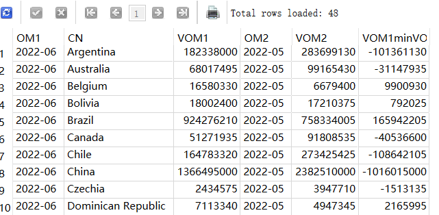

#### Data visualisation

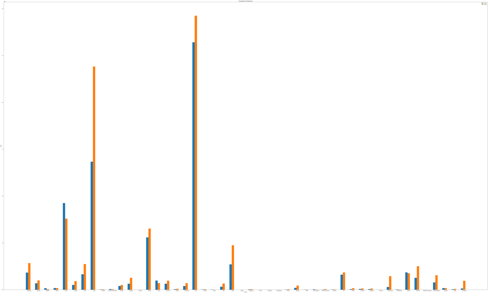

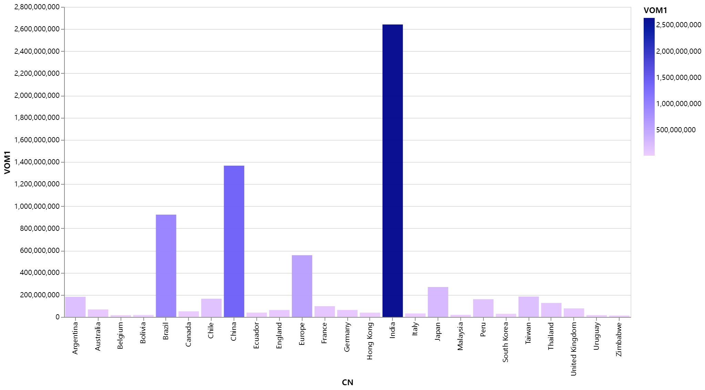


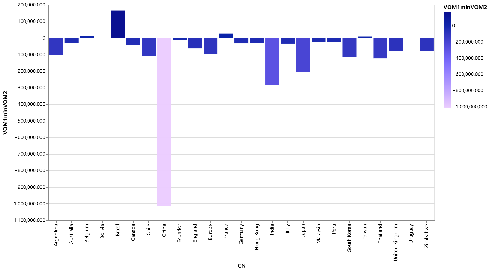

### Task D2

#### The SQL query

```sql
WITH RankedNumbers AS (
  SELECT
    MONTH,
    CountryName,
    Cumulative_Doses,
    ROW_NUMBER() OVER (PARTITION BY MONTH ORDER BY Cumulative_Doses DESC) AS rn,
    COUNT(*) OVER (PARTITION BY MONTH) AS total_count
  FROM
    (SELECT 
                        L.DATE_ AS MONTH,
                        L.LOCATION_ AS CountryName,
                        L.TOTAL_VACCINATIONS AS Cumulative_Doses
                    FROM 
                        Location_Data_Total L,US_Location
                    WHERE 
                        L.LOCATION_ NOT IN ('Africa','Asia','World','European Union','High income','Low income','Lower middle income',
                        'South Africa','South America','Upper middle income','North America','Oceania') AND
                        L.DATE_ regexp '^[0-9]{1,}/1/[0-9]{4}$' AND
                        L.LOCATION_ NOT IN (SELECT DISTINCT LOCATION_ FROM US_Location) AND L.TOTAL_VACCINATIONS !=""
                    ORDER BY 
                        L.DATE_)
)
SELECT
    CountryName,
    SUBSTR(SUBSTR(A,INSTR(A,'-')+1,LENGTH(A)),INSTR(SUBSTR(A,INSTR(A,'-')+1,LENGTH(A)),'-')+1)|| '-' || SUBSTR(A,0,INSTR(A,'-')) AS MONTH,
    Cumulative_Doses
FROM
(SELECT DISTINCT
  REPLACE(MONTH,'/','-') AS A,
  CountryName,
  Cumulative_Doses
FROM
 RankedNumbers
WHERE
  rn <= total_count / 2
ORDER BY
MONTH)
ORDER BY
MONTH;
```

#### The snapshot

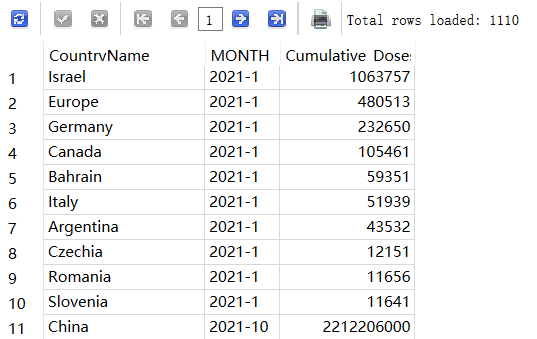

#### Data visualisation

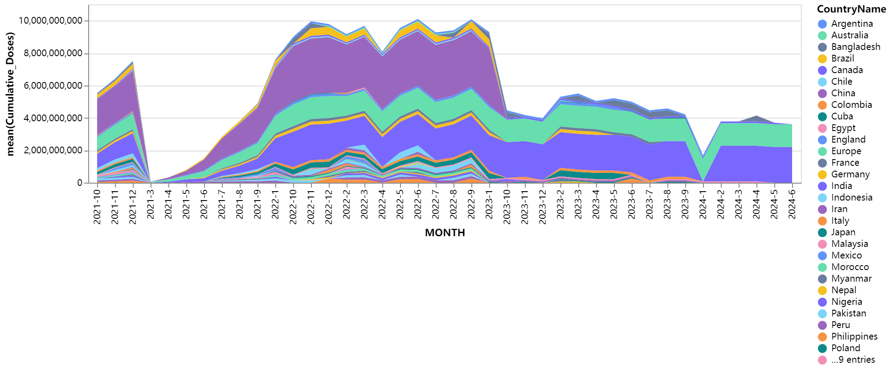

### Task D3

#### The SQL query

```sql
SELECT DISTINCT
        L.LOCATION_ AS Country,
        L.VACCINE AS Vaccine_Type
    FROM 
        Record_Vaccine L
    WHERE 
        L.LOCATION_ NOT IN ('Africa','Asia','World','European Union','High income','Low income','Lower middle income',
        'South Africa','South America','Upper middle income','North America','Oceania')
    ORDER BY 
        L.VACCINE;
```

#### The snapshot

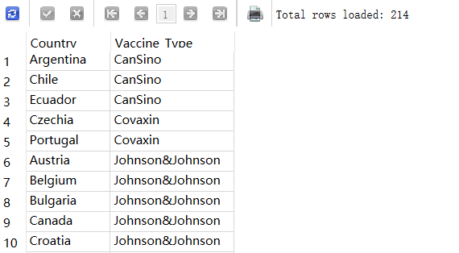

#### Data visualisation

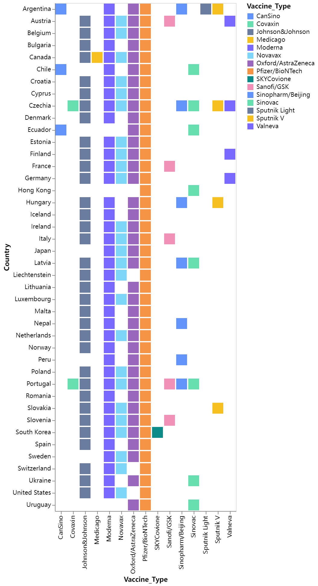

### Task D4

#### The SQL query

```sql
SELECT 
    T1.Country_Name,
    T1.URL AS Source_Name,
    T2.AN AS Total_Administered_Vaccines
FROM
    (SELECT DISTINCT
            L.LOCATION_ AS Country_Name,
            L.SOURCE_WEBSITE AS URL
        FROM 
            Location_Data_Total L
        WHERE 
            L.LOCATION_ NOT IN ('Africa','Asia','World','European Union','High income','Low income','Lower middle income',
            'South Africa','South America','Upper middle income','North America','Oceania')
            AND L.SOURCE_WEBSITE !='' 
        GROUP BY 
            L.LOCATION_, L.SOURCE_WEBSITE) T1
LEFT JOIN 
    (SELECT 
            L.LOCATION_ AS Country_N,
            MAX(L.TOTAL_VACCINATIONS) AS AN
        FROM 
            Location_Data_Total L
        WHERE 
            L.LOCATION_ NOT IN ('Africa','Asia','World','European Union','High income','Low income','Lower middle income',
            'South Africa','South America','Upper middle income','North America','Oceania') AND L.TOTAL_VACCINATIONS!=""
   
        GROUP BY
        L.LOCATION_) T2
ON T1.Country_Name = T2.Country_N;
```

#### The snapshot

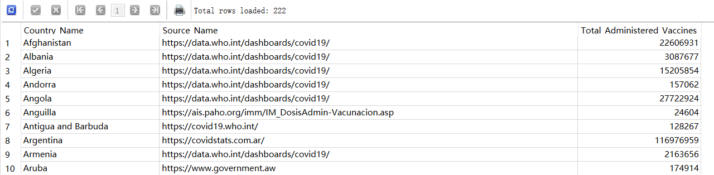

#### Data visualisation

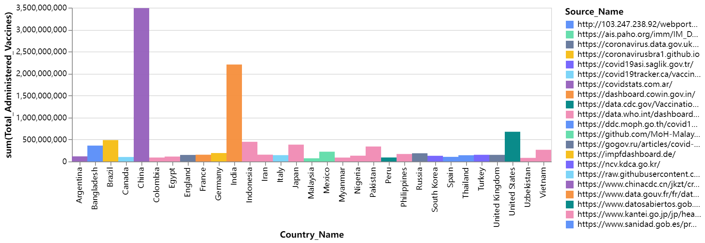

### Task D5

#### The SQL query

```sql
SELECT
SUBSTR(SUBSTR(A,INSTR(A,'-')+1,LENGTH(A)),INSTR(SUBSTR(A,INSTR(A,'-')+1,LENGTH(A)),'-')+1)|| '-' || SUBSTR(A,0,INSTR(A,'-')) AS MONTH,
United_States,
Wales,
Canada,
Denmark
FROM
(SELECT 
    REPLACE(T1.MONTH,'/','-') AS A,

    T1.United_States AS United_States,
    T2.Wales AS Wales,
    T3.Canada AS Canada,
    T4.Denmark AS Denmark
FROM
    ((SELECT DISTINCT
            L.DATE_ AS MONTH,
            L.PEOPLE_FULLY_VACCINATED AS United_States
        FROM 
            Location_Data_NON_Total L
        WHERE 
            L.DATE_ regexp '.*(?:2022|2023)$' AND
            L.LOCATION_ = 'United States'AND
            L.PEOPLE_FULLY_VACCINATED!=""
            ) T1
LEFT JOIN 
    (SELECT DISTINCT
            L.DATE_ AS MONTH,
            L.PEOPLE_FULLY_VACCINATED AS Wales
        FROM 
            Location_Data_NON_Total L
        WHERE 
        L.DATE_ regexp '.*(?:2022|2023)$' AND
            L.LOCATION_ = 'Wales'AND
            L.PEOPLE_FULLY_VACCINATED!=""
            ) T2
ON T1.MONTH = T2.MONTH
LEFT JOIN 
    (SELECT DISTINCT
            L.DATE_ AS MONTH,
            L.PEOPLE_FULLY_VACCINATED AS Canada
        FROM 
            Location_Data_NON_Total L
        WHERE 

            L.LOCATION_ = 'Canada'
            AND
            L.PEOPLE_FULLY_VACCINATED!="" AND
            L.DATE_ regexp '.*(?:2022|2023)$'
           ) T3
ON T1.MONTH = T3.MONTH
LEFT JOIN 
    (SELECT DISTINCT
            L.DATE_ AS MONTH,
            L.PEOPLE_FULLY_VACCINATED AS Denmark
        FROM 
            Location_Data_NON_Total L
        WHERE 
        L.DATE_ regexp '.*(?:2022|2023)$' AND
            L.LOCATION_ = 'Denmark' AND
            L.PEOPLE_FULLY_VACCINATED!=""
            ) T4
ON T1.MONTH = T4.MONTH
)
WHERE 
1
ORDER BY
    T1.MONTH
)
GROUP BY
MONTH
ORDER BY
MONTH
;
```

#### The snapshot

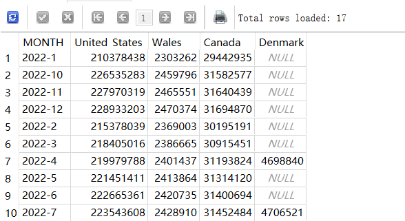

#### Data visualisation

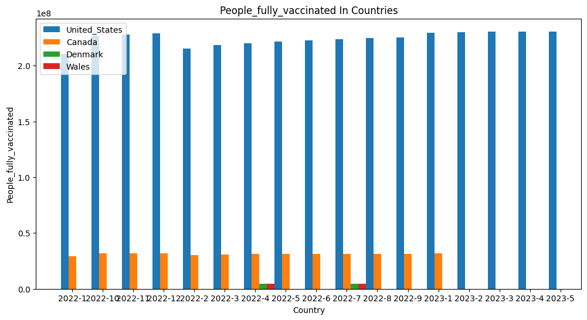
